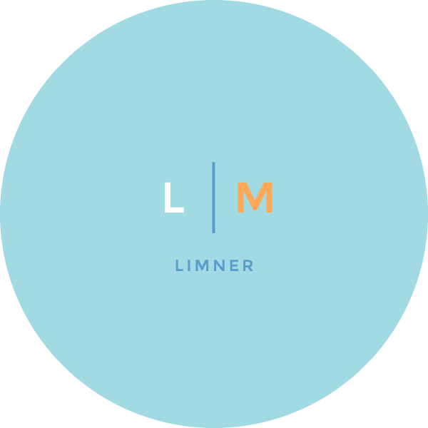
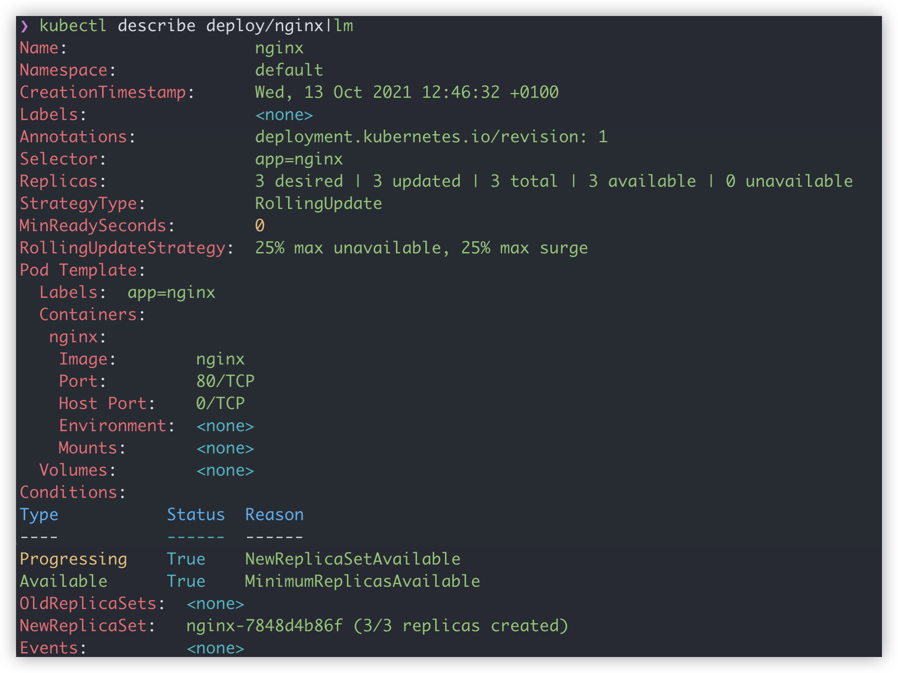
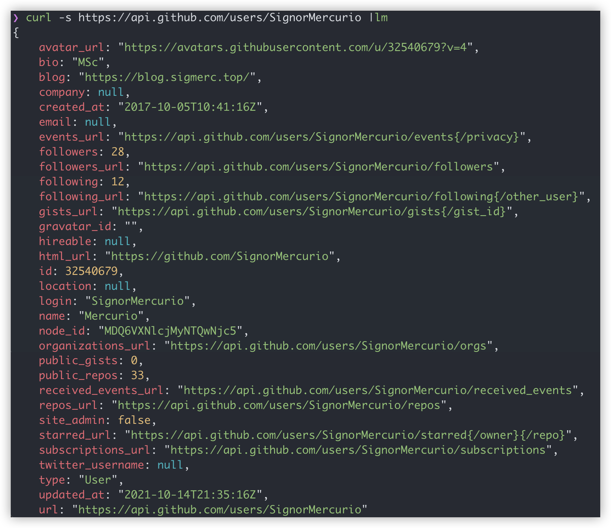
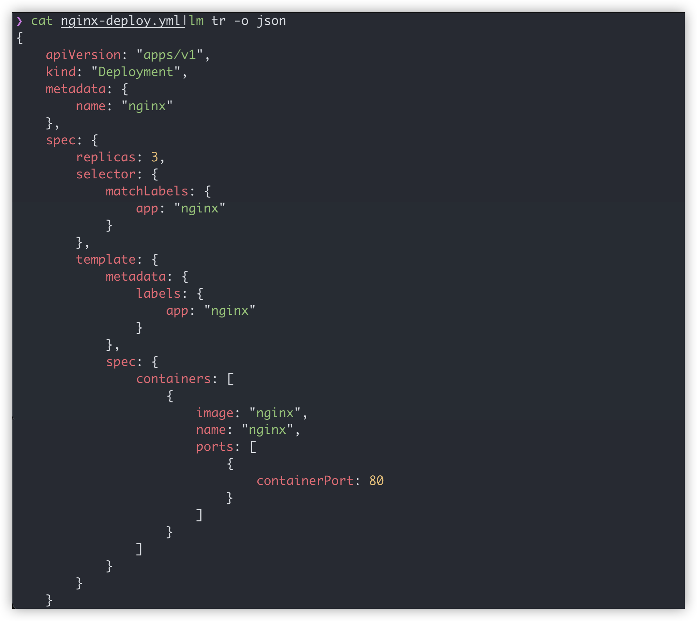
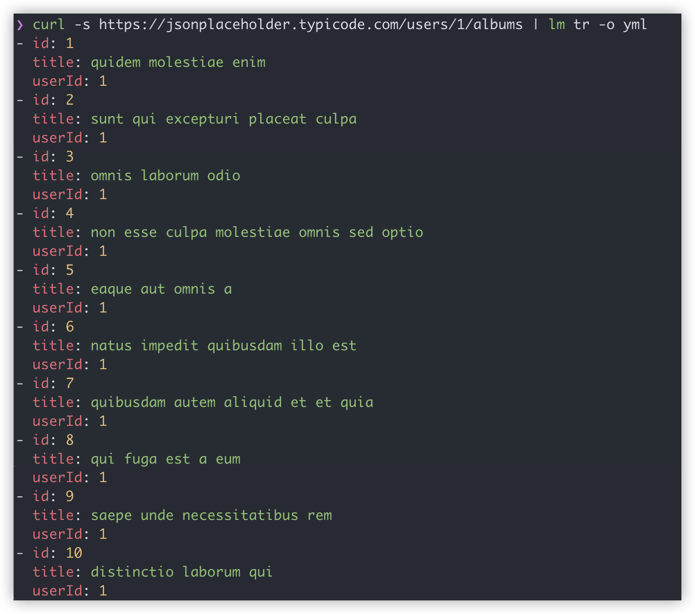
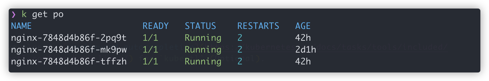

<p align="center">

</p>

<h1 align="center">Limner</h1>

<div align="center">

Limner 是一个对 CLI 输出进行染色与变换的工具

[English](README.md) | 简体中文

<a href="https://github.com/SignorMercurio/limner/actions"></a>
<a href="https://codecov.io/gh/SignorMercurio/limner"></a>
<a href="https://goreportcard.com/report/github.com/SignorMercurio/limner"></a>
<a href="https://github.com/SignorMercurio/limner/blob/main/LICENSE"> </a>

<a href="https://asciinema.org/a/ZtR2TaQPJWSUwTSIInSKZmrFu" target="_blank"></a>

</div>

## 编写工具的原因

使用 `kubectl` 时，有时会发现 CLI 输出的**一长串的、单色的**结果并不容易阅读，也不方便从中快速获得所需要的信息。同理，使用 `curl` 测试 REST API 时，常常也会返回一长串 JSON 响应数据。

当然可以通过使用 GUI 工具来绕过这一问题，比如 _Kubernetes Dashboard_ 和 Postman 等。但对于许多简单的、需要快速执行并快速查看结果的操作，使用 CLI 更为方便。因此编写了 limner 来为 CLI 的输出注入活力。

## 安装

### 从 Release 中下载二进制文件

进入 [Release 页面](https://github.com/SignorMercurio/limner/releases)，下载合适版本的 release 并运行：

```bash
tar zxvf lm_[version]_[os]_[arch].tar.gz
cd lm_[version]_[os]_[arch]
mv ./lm_[os]_[arch] ./lm
chmod +x ./lm
[your command] | ./lm
```

注意替换 `[]` 中内容。

### 手动安装

1. 确保已经 [安装了 Go](https://golang.org/doc/install)。

2. 克隆本仓库：

```bash
git clone https://github.com/SignorMercurio/limner.git
cd limner
go build -o lm .
```

3. 运行：

```bash
[your command] | ./lm
```

> 注：强烈建议将二进制文件添加到 $PATH 中，例如 `/usr/local/bin`。

## 使用方法

### 基本使用

大多数情况下，使用 limner 并不需要添加任何参数，因为 limner 会自动对输出的类型进行检测。

#### 对表格染色

```bash
kubectl get po | lm
```


#### 对 YAML 文件染色

```bash
kubectl describe deploy/nginx | lm
```



#### 对 JSON 响应染色

```bash
curl -s https://api.github.com/users/SignorMercurio | lm
```



#### YAML 转 JSON

```bash
cat nginx/deploy.yml | lm tr -i yaml -o json
```

只要输入是 YAML 格式（或者看起来像 YAML），你就可以省略 `-i yaml`，其他格式同理。



#### JSON 转 YAML

```bash
curl -s https://jsonplaceholder.typicode.com/users/1/albums | lm tr -o yml
```



> TODO: 支持对更多输出类型的染色以及格式转换。

### 创建快捷方式

以 `kubectl` 为例。

#### Bash

假设你已经为 `kubectl` 配置了 [自动补全](https://kubernetes.io/docs/tasks/tools/included/optional-kubectl-configs-bash-linux/)（非必需）。

在你的 `.bash_profile` 或 `.bashrc` 文件中, 添加：

```bash
function k() {kubectl $@ | lm}
complete -o default -F __start_kubectl k
```

#### Zsh

假设你已经为 `kubectl` 配置了 [自动补全](https://kubernetes.io/docs/tasks/tools/included/optional-kubectl-configs-zsh/)（非必需）。

在你的 `.zprofile` 或 `.zshrc` 文件中，添加：

```bash
function k() {kubectl $@ | lm}
compdef k=kubectl
```

随后，你就能使用带彩色输出和自动补全的 `kubectl`了：



### 输出到非标准输出

当你将结果输出到文件或是其他程序时（如通过管道 `|` 和重定向 `>`），你当然不希望 limner 对输出进行染色。因此可以使用 `--plain` 标志（或 `-p`）阻止 limner 的染色功能。

### 自定义颜色主题

你可以使用配置文件来自定义颜色主题。limner 默认读取 `$HOME/.limner.yaml` 作为配置文件，不过你也可以使用 `-c` 来手动指定文件位置，如：

```bash
kubectl get po | lm -c config/limner.yml
```

颜色配置文件的一个示例如下（默认配置）：

```yaml
key_color: Red
string_color: Green
bool_color: Yellow
number_color: Yellow
null_color: Cyan
header_color: Blue
column_colors:
  - White
  - Cyan
```

可选的颜色包括： `Red`, `Green`, `Yellow`, `Cyan`, `Blue`, `Magenta`, `White` 和 `Black`。

### 指定输出类型

声明 `-t` 来强制指定输出的类型： YAML / JSON / table 等。例如:

```bash
kubectl describe deploy/nginx | lm -t yaml
```

> 注：使用 `kubectl describe` 时并不需要声明 `-t yaml`。

### 格式转换

正如在 [YAML 转 JSON](#yaml-转-json) 中看到的那样，只需要：

```bash
[something of input type] | lm -o [output type]
```

使用 `-i [input type]` 以强制指定输入类型。

## 参与项目

欢迎以任何形式参与到本项目，如：

- 提交 Issue
- 提交 Pull Request
- 在 Issue / PR 中参与讨论
- 提交 Discussion

感谢您愿意参与本项目！

## 开发历程

- [x] 基础染色功能
  - [x] YAML
  - [x] JSON
  - [x] Tables
  - [ ] ...
- [x] 简单数据格式转换
  - [x] YAML <-> JSON
  - [ ] ...

如果对项目功能有任何建议和意见，欢迎提交 [issue](https://github.com/SignorMercurio/limner/issues) 或 [pull request](https://github.com/SignorMercurio/limner/pulls)。

## 开源协议

本项目采用 MIT 协议。详情参见 [LICENSE](LICENSE)。

## 致谢

灵感来源于以下这些出色的项目：

- [cobra](https://github.com/spf13/cobra)
- [kubecolor](https://github.com/dty1er/kubecolor)
- [yh](https://github.com/andreazorzetto/yh)
